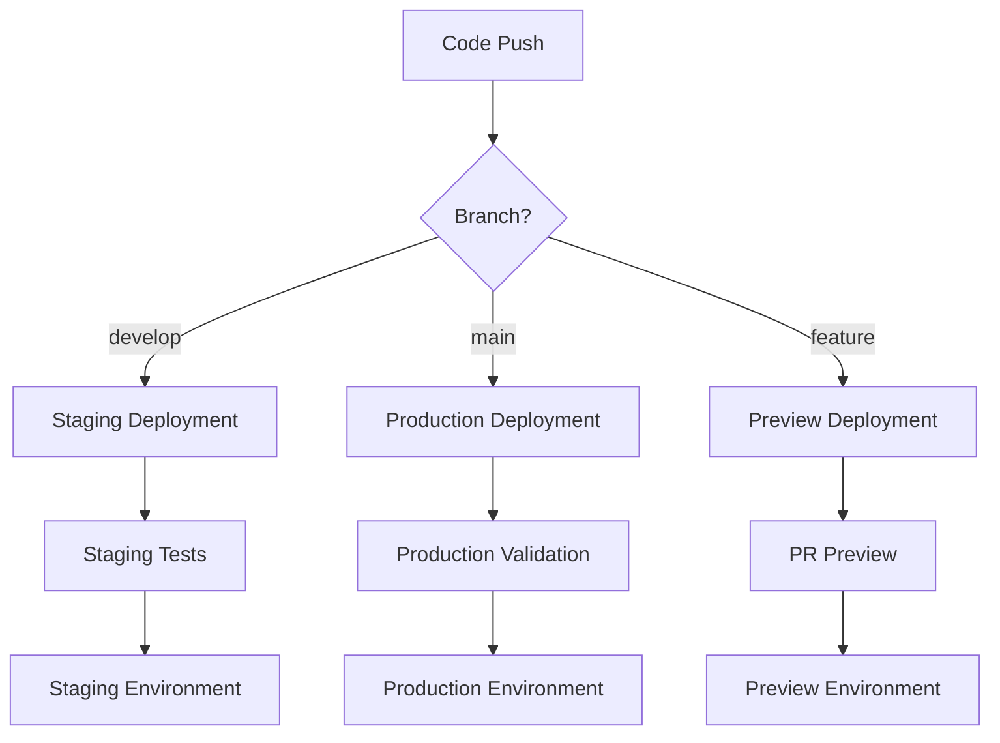

# GitHub Actions CI/CD Pipeline

This directory contains the GitHub Actions workflows for the Student Tracking App CI/CD pipeline.

## 🚀 Workflows Overview

### 1. Continuous Integration (`ci.yml`)
**Triggers:** Push to `main`/`develop`, Pull Requests
**Purpose:** Code quality, testing, and build verification

**Jobs:**
- **Code Quality & Linting:** ESLint, TypeScript checking, Prettier formatting
- **Testing:** Unit tests, component tests, API tests (matrix strategy)
- **Coverage:** Test coverage reporting with Codecov integration
- **Build Verification:** Production build validation
- **Security Scan:** npm audit and dependency checking
- **Notification:** Results summary and status reporting

### 2. Build Verification & Security (`build-verification.yml`)
**Triggers:** Push to `main`/`develop`, Pull Requests, Daily schedule
**Purpose:** Comprehensive build testing and security analysis

**Jobs:**
- **Dependency Analysis:** Package auditing and license compliance
- **Build Matrix:** Multi-OS and Node.js version testing
- **Security Vulnerability Scan:** Enhanced security auditing
- **Bundle Analysis:** Build size and optimization analysis
- **Performance Baseline:** Basic performance metrics

### 3. Staging Deployment (`deploy-staging.yml`)
**Triggers:** Push to `develop` branch
**Purpose:** Automated staging environment deployment

**Jobs:**
- **Pre-deployment Checks:** Quick tests and build verification
- **Deploy to Staging:** Vercel preview deployment
- **Post-deployment Verification:** Health checks and smoke tests
- **Notification:** PR comments with deployment links

### 4. Production Deployment (`deploy-production.yml`)
**Triggers:** Push to `main` branch, Releases, Manual dispatch
**Purpose:** Production deployment with comprehensive validation

**Jobs:**
- **Pre-production Validation:** Full test suite and security audit
- **Production Deployment:** Vercel production deployment
- **Post-deployment Monitoring:** Health checks and performance monitoring
- **Rollback Capability:** Rollback instructions and monitoring
- **Notification:** Deployment status and summary

### 5. Vercel Integration (`vercel-integration.yml`)
**Triggers:** Push to any branch, Pull Requests
**Purpose:** Seamless Vercel deployment integration

**Jobs:**
- **Preview Deployment:** Automatic preview deployments for PRs
- **Production Deployment:** Main branch production deployments
- **Deployment Verification:** Health checks and functionality tests
- **Cleanup:** Automatic cleanup of old deployments

## 🔧 Required Secrets

Configure these secrets in your GitHub repository settings:

### Vercel Integration
```
VERCEL_TOKEN          # Vercel API token
VERCEL_ORG_ID         # Vercel organization ID
VERCEL_PROJECT_ID     # Vercel project ID
CUSTOM_DOMAIN         # (Optional) Custom domain for production
```

### External Services
```
CODECOV_TOKEN         # (Optional) Codecov integration token
```

## 📋 Environment Setup

### 1. Vercel Configuration
1. Install Vercel CLI: `npm i -g vercel`
2. Login: `vercel login`
3. Link project: `vercel link`
4. Get org and project IDs: `vercel project ls`

### 2. GitHub Secrets Setup
1. Go to repository Settings → Secrets and variables → Actions
2. Add the required secrets listed above
3. Ensure proper permissions for GitHub Actions

### 3. Branch Protection Rules
Recommended branch protection for `main`:
- Require pull request reviews
- Require status checks to pass before merging
- Require branches to be up to date before merging
- Include administrators in restrictions

## 🔄 Workflow Triggers

| Workflow | Push (main) | Push (develop) | Pull Request | Schedule | Manual |
|----------|-------------|----------------|--------------|----------|--------|
| CI | ✅ | ✅ | ✅ | ❌ | ✅ |
| Build Verification | ✅ | ✅ | ✅ | ✅ (daily) | ✅ |
| Deploy Staging | ❌ | ✅ | ❌ | ❌ | ✅ |
| Deploy Production | ✅ | ❌ | ❌ | ❌ | ✅ |
| Vercel Integration | ✅ | ✅ | ✅ | ❌ | ✅ |

## 📊 Workflow Status Badges

Add these badges to your README.md:

```markdown


```

## 🚨 Troubleshooting

### Common Issues

1. **Vercel Token Issues**
   - Ensure token has correct permissions
   - Check token expiration
   - Verify org and project IDs

2. **Test Failures**
   - Check test logs in Actions tab
   - Run tests locally: `npm run test:ci`
   - Verify dependencies are up to date

3. **Build Failures**
   - Check Node.js version compatibility
   - Verify environment variables
   - Review build logs for specific errors

4. **Deployment Failures**
   - Check Vercel dashboard for deployment logs
   - Verify environment variables in Vercel
   - Ensure proper build configuration

### Debug Commands

```bash
# Run tests locally
npm run test:ci

# Check build locally
npm run build

# Verify linting
npm run lint

# Check formatting
npm run format:check

# Security audit
npm audit
```

## 📈 Monitoring and Metrics

### Coverage Reports
- Coverage reports are uploaded to Codecov
- Minimum coverage thresholds are enforced
- Coverage trends are tracked over time

### Performance Monitoring
- Response time baselines are established
- Performance regressions are detected
- Bundle size analysis is performed

### Security Monitoring
- Daily security scans
- Dependency vulnerability tracking
- License compliance checking

## 🔄 Deployment Flow



## 📚 Additional Resources

- [GitHub Actions Documentation](https://docs.github.com/en/actions)
- [Vercel Deployment Documentation](https://vercel.com/docs)
- [Jest Testing Framework](https://jestjs.io/docs/getting-started)
- [Next.js Deployment Guide](https://nextjs.org/docs/deployment)
