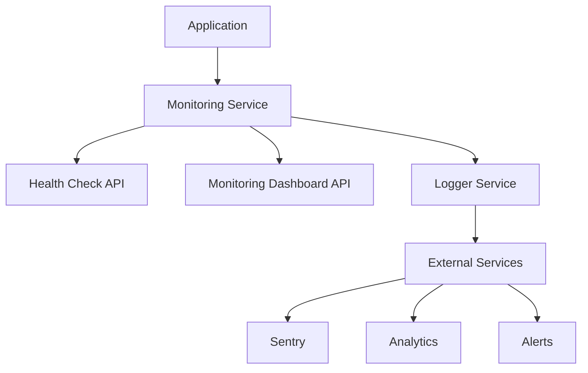

# Monitoring and Observability Guide

This guide covers the comprehensive monitoring setup for the Student Tracking App, including health checks, performance monitoring, error tracking, and alerting.

## 📋 Table of Contents

1. [Overview](#-overview)
2. [Health Check Endpoints](#-health-check-endpoints)
3. [Performance Monitoring](#-performance-monitoring)
4. [Error Tracking](#-error-tracking)
5. [Monitoring Dashboard](#-monitoring-dashboard)
6. [External Integrations](#-external-integrations)
7. [Alerting Setup](#-alerting-setup)
8. [Troubleshooting](#-troubleshooting)

## 🔍 Overview

The monitoring system provides comprehensive observability into:

- **System Health**: Memory usage, uptime, response times
- **Performance Metrics**: API response times, database performance, AI service latency
- **Error Tracking**: Application errors, API failures, user-reported issues
- **User Analytics**: Feature usage, user interactions, system events
- **Security Events**: Authentication failures, rate limiting, suspicious activity

### Architecture



## 🏥 Health Check Endpoints

### Primary Health Check

**Endpoint**: `GET /api/health`

**Response Format**:
```json
{
  "status": "healthy|degraded|unhealthy",
  "timestamp": "2024-01-15T10:30:00Z",
  "version": "1.0.0",
  "environment": "production",
  "uptime": 3600,
  "checks": {
    "database": {
      "status": "pass|fail|warn",
      "responseTime": 45,
      "message": "Database connection successful"
    },
    "vectorDatabase": {
      "status": "pass|fail|warn",
      "responseTime": 120,
      "message": "Vector database connection successful"
    },
    "aiServices": {
      "status": "pass|fail|warn",
      "responseTime": 200,
      "message": "All AI services accessible",
      "details": {
        "services": [
          {"name": "OpenAI", "status": "pass"},
          {"name": "Google Gemini", "status": "pass"}
        ]
      }
    },
    "memory": {
      "status": "pass|warn|fail",
      "message": "Memory usage: 256MB / 512MB (50%)",
      "details": {
        "heapUsed": 256,
        "heapTotal": 512,
        "usagePercent": 50
      }
    }
  },
  "metadata": {
    "nodeVersion": "v18.17.0",
    "platform": "linux",
    "requestId": "health_123456789"
  }
}
```

### Status Codes

- **200**: Healthy or degraded (with warnings)
- **503**: Unhealthy (critical failures)

### Usage Examples

```bash
# Basic health check
curl https://your-app.vercel.app/api/health

# Health check with specific timeout
curl --max-time 10 https://your-app.vercel.app/api/health

# Health check in CI/CD
if curl -f https://your-app.vercel.app/api/health; then
  echo "✅ Application is healthy"
else
  echo "❌ Application health check failed"
  exit 1
fi
```

## 📊 Performance Monitoring

### Monitoring Dashboard

**Endpoint**: `GET /api/monitoring`

**Query Parameters**:
- `type`: `dashboard|metrics|events|health`
- `timeRange`: Time range in milliseconds (default: 3600000 = 1 hour)
- `name`: Specific metric name (for metrics type)
- `limit`: Number of results to return

### Key Metrics Tracked

#### API Performance
- **Request Duration**: Response time for API endpoints
- **Request Count**: Number of requests per endpoint
- **Error Rate**: Percentage of failed requests
- **Status Code Distribution**: 2xx, 4xx, 5xx response codes

#### Database Performance
- **Query Duration**: Database query execution time
- **Connection Pool**: Active/idle connections
- **Query Success Rate**: Successful vs failed queries

#### AI Services Performance
- **API Call Duration**: Time for AI service requests
- **Success Rate**: Successful vs failed AI API calls
- **Token Usage**: API token consumption (if available)

#### System Metrics
- **Memory Usage**: Heap usage and garbage collection
- **CPU Usage**: Process CPU utilization
- **Uptime**: Application uptime
- **Response Time**: Average response time

### Usage Examples

```bash
# Get monitoring dashboard
curl "https://your-app.vercel.app/api/monitoring?type=dashboard"

# Get specific metric
curl "https://your-app.vercel.app/api/monitoring?type=metrics&name=api_request_duration"

# Get recent events
curl "https://your-app.vercel.app/api/monitoring?type=events&limit=50"

# Get health metrics
curl "https://your-app.vercel.app/api/monitoring?type=health"
```

### Client-Side Monitoring

```typescript
import { useMonitoring } from '@/lib/monitoring'

function MyComponent() {
  const { trackEvent, trackPerformance } = useMonitoring()
  
  const handleButtonClick = () => {
    trackEvent('button_click', { component: 'MyComponent' })
  }
  
  useEffect(() => {
    const start = performance.now()
    
    // Some operation
    fetchData().then(() => {
      const duration = performance.now() - start
      trackPerformance('data_fetch', duration)
    })
  }, [])
  
  return <button onClick={handleButtonClick}>Click me</button>
}
```

## 🚨 Error Tracking

### Automatic Error Logging

All errors are automatically logged with:
- Error message and stack trace
- Request context (URL, method, headers)
- User information (if available)
- System state at time of error

### Error Categories

1. **Application Errors**: Unhandled exceptions, validation errors
2. **API Errors**: External service failures, timeout errors
3. **Database Errors**: Connection failures, query errors
4. **Security Errors**: Authentication failures, rate limiting
5. **Client Errors**: JavaScript errors, network failures

### Error Reporting API

**Endpoint**: `POST /api/monitoring`

```typescript
// Report client-side error
fetch('/api/monitoring', {
  method: 'POST',
  headers: { 'Content-Type': 'application/json' },
  body: JSON.stringify({
    type: 'error',
    data: {
      error: 'Network request failed',
      context: {
        url: '/api/students',
        method: 'GET',
        userAgent: navigator.userAgent
      },
      userId: 'user123',
      sessionId: 'session456'
    }
  })
})
```

## 📈 Monitoring Dashboard

### Dashboard Metrics

The monitoring dashboard provides:

1. **System Overview**:
   - Overall health status
   - Uptime and availability
   - Memory and CPU usage
   - Active connections

2. **Performance Metrics**:
   - Average response times
   - Request throughput
   - Error rates
   - Database performance

3. **Recent Activity**:
   - Latest events and errors
   - User interactions
   - System alerts

4. **Trends**:
   - Performance over time
   - Error rate trends
   - Usage patterns

### Accessing the Dashboard

```bash
# Get full dashboard data
curl "https://your-app.vercel.app/api/monitoring?type=dashboard&timeRange=3600000"
```

**Response includes**:
- System health summary
- Performance metrics
- Recent events
- Top metrics
- Health score

## 🔗 External Integrations

### Sentry Integration

1. **Setup**:
   ```bash
   npm install @sentry/nextjs
   ```

2. **Configuration**:
   ```typescript
   // sentry.client.config.ts
   import * as Sentry from '@sentry/nextjs'
   
   Sentry.init({
     dsn: process.env.SENTRY_DSN,
     environment: process.env.NODE_ENV,
     tracesSampleRate: 1.0,
   })
   ```

3. **Environment Variable**:
   ```bash
   SENTRY_DSN=your_sentry_dsn_here
   ```

### Vercel Analytics

1. **Enable in Vercel Dashboard**:
   - Go to Project Settings → Analytics
   - Enable Web Analytics
   - Configure Core Web Vitals tracking

2. **Add to Application**:
   ```typescript
   // app/layout.tsx
   import { Analytics } from '@vercel/analytics/react'
   
   export default function RootLayout({ children }) {
     return (
       <html>
         <body>
           {children}
           <Analytics />
         </body>
       </html>
     )
   }
   ```

### Uptime Monitoring

Recommended external services:
- **UptimeRobot**: Free tier available
- **Pingdom**: Comprehensive monitoring
- **StatusCake**: Global monitoring network

**Setup**:
1. Create account with monitoring service
2. Add health check URL: `https://your-app.vercel.app/api/health`
3. Configure check interval (recommended: 5 minutes)
4. Set up alert notifications

## 🚨 Alerting Setup

### GitHub Actions Alerts

Automatic alerts for:
- Deployment failures
- Test failures
- Security scan issues
- Performance degradation

### Application Alerts

Configure alerts for:
- High error rates (>5%)
- Slow response times (>2 seconds)
- Memory usage (>90%)
- Database connection failures
- AI service outages

### Alert Channels

1. **Email Notifications**: Critical issues
2. **Slack Integration**: Team notifications
3. **SMS Alerts**: Emergency situations
4. **GitHub Issues**: Automatic issue creation

### Example Alert Configuration

```yaml
# .github/workflows/monitoring-alerts.yml
name: Monitoring Alerts

on:
  schedule:
    - cron: '*/5 * * * *'  # Every 5 minutes

jobs:
  health-check:
    runs-on: ubuntu-latest
    steps:
      - name: Check application health
        run: |
          if ! curl -f https://your-app.vercel.app/api/health; then
            echo "❌ Health check failed"
            # Send alert notification
            curl -X POST ${{ secrets.SLACK_WEBHOOK }} \
              -H 'Content-Type: application/json' \
              -d '{"text": "🚨 Application health check failed!"}'
            exit 1
          fi
```

## 🔧 Troubleshooting

### Common Issues

#### High Memory Usage
```bash
# Check memory metrics
curl "https://your-app.vercel.app/api/monitoring?type=health"

# Solutions:
# - Optimize database queries
# - Implement caching
# - Review memory leaks
```

#### Slow Response Times
```bash
# Check performance metrics
curl "https://your-app.vercel.app/api/monitoring?type=metrics&name=api_request_duration"

# Solutions:
# - Optimize database indexes
# - Implement API caching
# - Review external API calls
```

#### High Error Rates
```bash
# Check recent errors
curl "https://your-app.vercel.app/api/monitoring?type=events&type=error"

# Solutions:
# - Review error logs
# - Check external service status
# - Validate input handling
```

### Debugging Commands

```bash
# Check application logs
vercel logs --follow

# Test health endpoint locally
npm run dev
curl http://localhost:3000/api/health

# Run performance tests
npm run test:performance

# Check bundle size
npm run build:analyze
```

### Performance Optimization

1. **Database Optimization**:
   - Add appropriate indexes
   - Optimize query patterns
   - Use connection pooling

2. **API Optimization**:
   - Implement response caching
   - Optimize payload sizes
   - Use compression

3. **Frontend Optimization**:
   - Code splitting
   - Image optimization
   - Lazy loading

4. **Infrastructure Optimization**:
   - CDN configuration
   - Edge caching
   - Geographic distribution

### Monitoring Best Practices

1. **Set Appropriate Thresholds**: Not too sensitive, not too lenient
2. **Monitor Trends**: Look for patterns over time
3. **Regular Reviews**: Weekly monitoring reviews
4. **Documentation**: Keep monitoring docs updated
5. **Testing**: Test monitoring and alerting systems
6. **Automation**: Automate responses where possible
