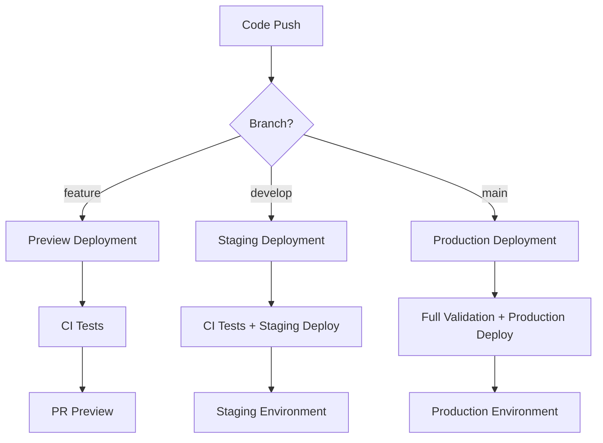

# Development Workflow Guide

This guide covers the complete development workflow, CI/CD processes, and testing procedures for the Student Tracking App.

## 📋 Table of Contents

1. [Development Workflow](#-development-workflow)
2. [Git Branching Strategy](#-git-branching-strategy)
3. [Testing Procedures](#-testing-procedures)
4. [CI/CD Pipeline](#-cicd-pipeline)
5. [Code Quality Standards](#-code-quality-standards)
6. [Release Process](#-release-process)
7. [Troubleshooting](#-troubleshooting)

## 🔄 Development Workflow

### Local Development Setup

1. **Clone Repository**:
   ```bash
   git clone https://github.com/your-username/student-tracking-app.git
   cd student-tracking-app/student-tracking-app
   ```

2. **Install Dependencies**:
   ```bash
   npm install
   ```

3. **Environment Setup**:
   ```bash
   cp .env.example .env.local
   # Edit .env.local with your development credentials
   ```

4. **Start Development Server**:
   ```bash
   npm run dev
   ```

5. **Run Tests**:
   ```bash
   npm run test:watch  # Watch mode for development
   npm run test        # Single run
   npm run test:coverage  # With coverage
   ```

### Development Commands

```bash
# Development
npm run dev              # Start development server
npm run build           # Build for production
npm run start           # Start production server
npm run lint            # Run ESLint
npm run lint:fix        # Fix ESLint issues
npm run type-check      # TypeScript type checking
npm run format          # Format code with Prettier
npm run format:check    # Check code formatting

# Testing
npm run test            # Run all tests
npm run test:watch      # Run tests in watch mode
npm run test:coverage   # Run tests with coverage
npm run test:ci         # Run tests in CI mode
npm run test:unit       # Run unit tests only
npm run test:components # Run component tests only
npm run test:api        # Run API tests only
npm run test:debug      # Run tests with verbose output
npm run test:update     # Update test snapshots

# Advanced
npm run test:script     # Use custom test runner
npm run build:analyze   # Analyze bundle size
```

## 🌿 Git Branching Strategy

### Branch Types

1. **Main Branch** (`main`):
   - Production-ready code
   - Protected branch
   - Automatic production deployment
   - Requires PR reviews

2. **Develop Branch** (`develop`):
   - Integration branch
   - Staging deployment
   - Feature branch target
   - Pre-production testing

3. **Feature Branches** (`feature/feature-name`):
   - New features and enhancements
   - Branch from `develop`
   - Merge back to `develop`
   - Automatic preview deployments

4. **Hotfix Branches** (`hotfix/issue-description`):
   - Critical production fixes
   - Branch from `main`
   - Merge to both `main` and `develop`
   - Emergency deployment capability

5. **Release Branches** (`release/version-number`):
   - Release preparation
   - Final testing and bug fixes
   - Version bumping
   - Merge to `main` and `develop`

### Workflow Process

```bash
# Feature Development
git checkout develop
git pull origin develop
git checkout -b feature/new-feature
# ... make changes ...
git add .
git commit -m "feat: add new feature"
git push origin feature/new-feature
# Create PR to develop

# Hotfix Process
git checkout main
git pull origin main
git checkout -b hotfix/critical-fix
# ... make changes ...
git add .
git commit -m "fix: critical production issue"
git push origin hotfix/critical-fix
# Create PR to main (and develop)

# Release Process
git checkout develop
git pull origin develop
git checkout -b release/v1.2.0
# ... final preparations ...
git add .
git commit -m "chore: prepare release v1.2.0"
git push origin release/v1.2.0
# Create PR to main
```

### Commit Message Convention

Follow [Conventional Commits](https://www.conventionalcommits.org/):

```bash
# Format: type(scope): description
feat(auth): add user authentication
fix(api): resolve database connection issue
docs(readme): update installation instructions
style(ui): improve button styling
refactor(utils): optimize helper functions
test(api): add integration tests
chore(deps): update dependencies
```

## 🧪 Testing Procedures

### Testing Strategy

1. **Unit Tests**: Individual component/function testing
2. **Integration Tests**: API routes and database operations
3. **Component Tests**: React component behavior
4. **End-to-End Tests**: Complete user workflows (future)

### Test Organization

```
src/
├── components/
│   └── __tests__/          # Component tests
├── lib/
│   └── __tests__/          # Utility function tests
├── app/api/
│   └── __tests__/          # API route tests
└── __tests__/
    └── test-utils.tsx      # Testing utilities
```

### Writing Tests

#### Component Tests
```typescript
// src/components/__tests__/Button.test.tsx
import { render, screen, fireEvent } from '@testing-library/react'
import Button from '../Button'

describe('Button', () => {
  it('renders with correct text', () => {
    render(<Button>Click me</Button>)
    expect(screen.getByText('Click me')).toBeInTheDocument()
  })

  it('calls onClick when clicked', () => {
    const handleClick = jest.fn()
    render(<Button onClick={handleClick}>Click me</Button>)
    fireEvent.click(screen.getByText('Click me'))
    expect(handleClick).toHaveBeenCalledTimes(1)
  })
})
```

#### API Tests
```typescript
// src/app/api/__tests__/health.test.ts
import { NextRequest } from 'next/server'
import { GET } from '../health/route'

describe('/api/health', () => {
  it('returns health status', async () => {
    const request = new NextRequest('http://localhost:3000/api/health')
    const response = await GET(request)
    const data = await response.json()
    
    expect(response.status).toBe(200)
    expect(data.status).toBeDefined()
  })
})
```

### Test Coverage Requirements

- **Minimum Coverage**: 75% overall
- **Components**: 70% coverage
- **Utilities**: 85% coverage
- **API Routes**: 75% coverage

### Running Tests

```bash
# Development
npm run test:watch          # Watch mode
npm run test:debug          # Verbose output
npm run test:coverage       # With coverage report

# CI/CD
npm run test:ci             # CI mode with coverage
npm run test:unit           # Unit tests only
npm run test:components     # Component tests only
npm run test:api            # API tests only
```

## 🚀 CI/CD Pipeline

### Pipeline Overview



### Workflow Triggers

| Workflow | Trigger | Purpose |
|----------|---------|---------|
| CI | Push, PR | Code quality, testing |
| Build Verification | Push, PR, Schedule | Build testing, security |
| Deploy Staging | Push to `develop` | Staging deployment |
| Deploy Production | Push to `main` | Production deployment |
| Vercel Integration | Push, PR | Seamless Vercel deployment |
| Secrets Validation | Schedule, Manual | Security validation |

### Pipeline Stages

#### 1. Code Quality (CI)
- ESLint checking
- Prettier formatting
- TypeScript compilation
- Import/export validation

#### 2. Testing (CI)
- Unit tests
- Component tests
- Integration tests
- Coverage reporting

#### 3. Build Verification
- Production build
- Bundle analysis
- Dependency checking
- Security scanning

#### 4. Deployment
- Environment validation
- Health checks
- Performance monitoring
- Rollback capability

### Environment Variables in CI/CD

```yaml
# GitHub Secrets (required)
VERCEL_TOKEN              # Vercel deployment
VERCEL_ORG_ID            # Vercel organization
VERCEL_PROJECT_ID        # Vercel project
NEON_DATABASE_URL        # Database connection
QDRANT_URL               # Vector database
QDRANT_API_KEY           # Vector database auth
NEXTAUTH_SECRET          # Authentication
OPENAI_API_KEY           # AI services
GOOGLE_GEMINI_API_KEY    # AI services

# Optional Secrets
CODECOV_TOKEN            # Coverage reporting
SENTRY_DSN               # Error tracking
CUSTOM_DOMAIN            # Custom domain
ALLOWED_ORIGINS          # CORS configuration
```

## 📏 Code Quality Standards

### ESLint Configuration

```json
{
  "extends": [
    "next/core-web-vitals",
    "@typescript-eslint/recommended"
  ],
  "rules": {
    "no-console": "warn",
    "no-unused-vars": "error",
    "@typescript-eslint/no-explicit-any": "warn"
  }
}
```

### Prettier Configuration

```json
{
  "semi": false,
  "trailingComma": "es5",
  "singleQuote": true,
  "printWidth": 100,
  "tabWidth": 2
}
```

### TypeScript Standards

- Strict mode enabled
- No implicit any
- Proper type definitions
- Interface over type when possible
- Consistent naming conventions

### File Organization

```
src/
├── app/                 # Next.js app directory
│   ├── api/            # API routes
│   ├── globals.css     # Global styles
│   ├── layout.tsx      # Root layout
│   └── page.tsx        # Home page
├── components/         # Reusable components
│   ├── ui/            # UI primitives
│   └── setup/         # Setup wizard components
├── lib/               # Utility functions
│   ├── config.ts      # Configuration management
│   ├── database.ts    # Database utilities
│   └── security.ts    # Security utilities
└── types/             # TypeScript type definitions
```

## 🚢 Release Process

### Version Management

Using [Semantic Versioning](https://semver.org/):
- **MAJOR**: Breaking changes
- **MINOR**: New features (backward compatible)
- **PATCH**: Bug fixes (backward compatible)

### Release Steps

1. **Prepare Release**:
   ```bash
   git checkout develop
   git pull origin develop
   git checkout -b release/v1.2.0
   npm version minor  # or major/patch
   ```

2. **Update Documentation**:
   - Update CHANGELOG.md
   - Update README.md if needed
   - Review deployment guide

3. **Final Testing**:
   ```bash
   npm run test:ci
   npm run build
   npm run lint
   ```

4. **Create Release PR**:
   - PR from release branch to main
   - Include changelog in PR description
   - Request reviews from team

5. **Deploy and Tag**:
   - Merge PR to main
   - Automatic production deployment
   - Create GitHub release with tag

6. **Post-Release**:
   - Merge main back to develop
   - Monitor deployment health
   - Update project boards

### Hotfix Process

1. **Create Hotfix**:
   ```bash
   git checkout main
   git checkout -b hotfix/critical-fix
   # Fix the issue
   npm version patch
   ```

2. **Test and Deploy**:
   ```bash
   npm run test:ci
   npm run build
   ```

3. **Merge to Main and Develop**:
   - Create PR to main
   - After merge, cherry-pick to develop
   - Monitor production deployment

## 🔧 Troubleshooting

### Common Issues

#### Build Failures
```bash
# Clear cache and reinstall
rm -rf node_modules package-lock.json
npm install

# Check TypeScript errors
npm run type-check

# Check linting issues
npm run lint
```

#### Test Failures
```bash
# Run specific test
npm test -- --testNamePattern="ComponentName"

# Update snapshots
npm run test:update

# Debug test
npm run test:debug
```

#### Deployment Issues
```bash
# Check Vercel logs
vercel logs

# Test build locally
npm run build
npm run start

# Validate environment variables
npm run test:script ci
```

### Getting Help

1. **Check Documentation**: Review this guide and deployment docs
2. **GitHub Issues**: Search existing issues or create new one
3. **Logs**: Check GitHub Actions logs and Vercel deployment logs
4. **Health Check**: Visit `/api/health` endpoint for system status
5. **Team Communication**: Use designated communication channels

### Performance Optimization

1. **Bundle Analysis**:
   ```bash
   ANALYZE=true npm run build
   ```

2. **Lighthouse Testing**:
   - Test Core Web Vitals
   - Monitor performance metrics
   - Optimize based on recommendations

3. **Database Optimization**:
   - Monitor query performance
   - Optimize database indexes
   - Use connection pooling

4. **API Optimization**:
   - Implement caching
   - Optimize API calls
   - Monitor rate limits
